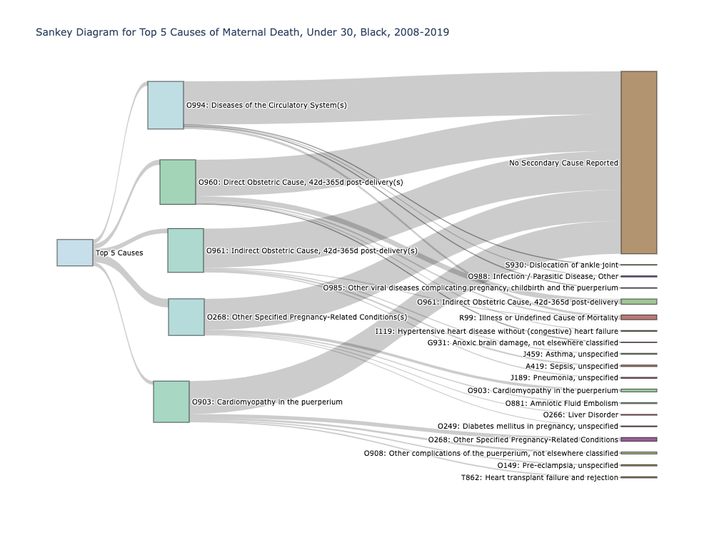

# Recognizing my Privilege of Safety and Examining Maternal Mortality Causes in the US
Becky Peters<br>
[GitHub](https://github.com/beckyepeters) | 
[LinkedIn](https://www.linkedin.com/in/beckyepeters/)<br>
October 2021

## What's Inside: 
* Facts and discussion about maternal mortality 
* How to make Sankey diagrams with Python & Plotly
* Mental Canvas Tour of Maternal Mortality in Select Countries

## Background & Motivation: 
*TLDR: Lots of personal and irrelevant-to-maternal-mortality information in this section; skip to EDA section for the data portion of the project.*

I have been “unemployed” for just over a year. I put that in quotes because I still have jobs, just not paid ones. I am a wife of 1 and a mother of 2, so I keep myself busy. I also completed the Galvanize Data Science Bootcamp (a fabulous experience for this career-shifter) which, like my children, secured more than a few hours of my attention each week. In short, I have obligations but no self-earned income. I’m currently job searching, and am committed to keeping my skills strong with interesting inquiries, like the one in this post.

I also took a bath the other day. I can’t believe I’m actually admitting to such a thing out loud. It feels so indulgent and undeserved. I’m not a bath person for many reasons, not the least of which being that baths feel like an incredible waste of time. (This coming from a person who will sometimes run at full speed from my car to the grocery store entrance just because I don’t want to waste the time walking. I just feel like I should be doing something else.) Why is this relevant to this project? Because I can’t help but consider the millions of other people working so much harder than me who deserve time to themselves, time to relax, and time to feel safe. 

There are so many ways to feel safe. Safe from hunger, safe from the elements, safe from indignities. You can be psychologically safe, physically safe, emotionally safe. And it occurred to me while I took this indulgent bath, while I followed a guided meditation, while I enjoyed the safety in knowing that my kids are safe today, too, while the little noises I heard were not those of approaching danger but just those of my fizzy water fizzing or a neighbor taking a walk in my suburban neighborhood. I am so privileged to be safe. And I wanted to dig into a dataset I've been thinking a lot about that demonstrates inequities in safety. 

## The Dataset
I recently read an [article from The Commonwealth Fund](https://www.commonwealthfund.org/publications/2021/sep/restoring-access-maternity-care-rural-america?utm_source=linkedin&utm_medium=social&utm_campaign=Advancing+Health+Equity+TransformingCare) about maternal mortality in rural areas and was horrified to discover that fully one-third of women who die during pregnancy in New Mexico die from car crashes; yes, some are from runs to the grocery store but most are from having to drive so far to find appropriate health care. And the [CDC cites](https://www.cdc.gov/reproductivehealth/maternal-mortality/pregnancy-mortality-surveillance-system.htm) the terrible reality that Black women are over THREE TIMES more likely to die from a pregnancy-related cause than white women in this country. 

## Exploratory Data Analysis
I used the [National Bureau of Economic Research's compilation of multiple mortality datasets from the US Vital Statistics records](https://www.nber.org/research/data/mortality-data-vital-statistics-nchs-multiple-cause-death-data) to examine these data further. I really wanted to look at them geographically but unfortunately due to a 2005 restriction imposed by the States, no geographic identifiers are included in the files from then to now. 

There has been an upward trend in maternal mortality in the United States over the past few decades. 

Figure 1: Trends in Pregnancy-Related Deaths, [Source: CDC PMSS](https://www.cdc.gov/reproductivehealth/maternal-mortality/pregnancy-mortality-surveillance-system.htm)


There is also a huge racial disparity among maternal mortality rates that does not seem to be improving. Figure 2 shows a graph from the same website that shows the breakdown of maternal mortality rates (per 100,000 live births) by race during 2014-2017. 

Figure 2: Racial Disparities in Maternal Mortality Rates


And those inequities actually increase with the age of the mother! The sharp inclines at 30 years old and above is something I wanted to dig into further.  

Figure 3: Racial Disparities Increase with Age


Below, I'll share how I used Sankey Diagrams in Plotly to examine the causes of death for white women under 30, black women under 30, white women over 30, and black women over 30. These graphs show causes of death for the cumulative number of women described above over the 2009-2018 time frame.  

To read in the data, I downloaded the CSV files from the [NBER page](https://www.nber.org/research/data/mortality-data-vital-statistics-nchs-multiple-cause-death-data) under the "U.S. Data Files - Death Data" section for years 2009-2018. Then, I used a simple function to clean the file as I wanted it (drop some columns and narrow causes to 'O' section for maternal mortality) and then added those cleaned Data Frames to a master Data Frame, as follows: 

```
def clean_mort_file(file_path): 
    df = pd.read_csv(file_path)
    df.drop(columns=to_drop, inplace=True)
    df = df[df['ucod'].str.startswith('O')]
    return df
```
```
files_list = ['data/mort2009.csv', 'data/mort2010.csv', 
             'data/mort2011.csv', 'data/mort2012.csv', 
             'data/mort2013.csv', 'data/mort2014.csv', 
             'data/mort2015.csv', 'data/mort2016.csv', 
             'data/mort2017.csv', 'data/Mort2018US.PubUse.csv']
```
```
for file in files_list: 
    df = clean_mort_file(file)
    main_df = main_df.append(df)
```
Then, I dropped a few more columns with a high percentage of missing values that did not pertain to the project, and, having kept Records 2, 3, 4, and 5, filled the NaN values in those columns with 'None' if no secondary, tertiary, etc. causes of death were reported. 

```
df.record_2.fillna(value='None', inplace=True)
df.record_3.fillna(value='None', inplace=True)
df.record_4.fillna(value='None', inplace=True)
df.record_5.fillna(value='None', inplace=True)
```

I also created a dictionary with the more detailed explanations for each code, which can be found in the accompanying Jupyter Notebooks. This left me with 9,113 total records of maternal mortality for the past 10 years.  

I replaced the numbers for the 'Race' column with appropriate labels to divide race into the 5 categories typically seen. Unfortunately, these data did not include Hispanic ethnicity as part of the records, so that is not included. 

The first thing I discovered is that the [ICD-10 (2016 Revision)](https://icd.who.int/browse10/2016/en) codes that give the most common primary reasons for death are pretty vague. The number one primary cause of death, with 18.8% of the total records (1,712 of the total 9,113 entries), is "O26.8", which is listed as "Other specified pregnancy-related conditions", and can include lots of things, like renal failure and exhaustion. But remember, the records have up to 20 causes listed for cause of death! So, are these ambiguous terms better defined as we follow the trail of records? The answer is, as usual, neither yes or no. In fact, for the most common cause of death ('O26.8'), 65% of the entries for Record 2 are 'None'. So, 1,112 entries have no further information about cause of death. And that is just for the first most common cause. The next few are not much better.  

Figure 4: Percentages of Total Death Records, Top 5 Causes for Primary Cause of Death 


As seen in Figure 4, the top 5 causes of death over the past 10 years are relatively ambiguous codes. Now, given the drastic elbow points in Figure 3, I wanted to dig deeper into the causes of death for Black and White persons over 30 and under 30, to see if there is a difference in reporting or in causes of death. 

I wrote a function to return a dataframe with Sankey-friendly linkages and values. 

```
def create_sankey_df(df): 
    san = pd.DataFrame(columns=['source', 'target', 'value'])
    top_5 = df.record_1.value_counts(normalize=True)[:5]
    df1 = df[df['record_1']==top_5_all.index[0]]
    df2 = df[df['record_1']==top_5_all.index[1]]
    df3 = df[df['record_1']==top_5_all.index[2]]
    df4 = df[df['record_1']==top_5_all.index[3]]
    df5 = df[df['record_1']==top_5_all.index[4]]
    list_of_dfs = [df1, df2, df3, df4, df5]
    list_of_top_5 = top_5.index
    list_of_causes = []
    list_of_causes.append(list_of_top_5.tolist())
    for i in range(5): 
        san = san.append({'source': 'Top 5 Causes', 'target': top_5.index[i]+'s', 'value': top_5[i]*100}, ignore_index=True)
    for idx, df in enumerate(list_of_dfs): 
        top = df.record_2.value_counts(normalize=True)[:5]
        list_of_causes.append(top.index.tolist())
        for i in range(5): 
            san = san.append({'source': list_of_top_5[idx]+'s', 'target': top.index[i], 'value': top[i]*100}, ignore_index=True)
    list_of_causes = list(set(list(chain.from_iterable(list_of_causes))))
    return san, list_of_causes
```
```
san, list_of_causes_all = create_sankey_df(df)
```
You also have to define the nodes for Sankey in a specific way, with numerical data instead of strings. So I encoded the labels according to the node map from the following function.

```
def set_sources_targets_nodes(san): 
    #   set source list from created 'san' df
    source_set = set([x for x in san.source])
    source_list = list(source_set)
    source_map = dict(zip(source_list,range(len(source_list))))
    source_map = {v: k for k, v in source_map.items()}
    #   set target list from created 'san' df
    target_set = set([x for x in san.target[5:]])
    target_list = list(target_set)
    target_map = dict(zip(target_list,range(6, 6+len(target_list))))
    target_map = {v: k for k, v in target_map.items()}
    #   set source list from created 'san' df

    source_nodes_list = source_list + target_list
    #   set nodes map from source & target maps 
    nodes_map = {**source_map, **target_map}
    return source_map, target_map, nodes_map
```
```
source_map, target_map, nodes_map = set_sources_targets_nodes(san)

san_coded = san.copy()
san_coded.source = san_coded.source.replace(to_replace={v: k for k, v in source_map.items()})
# replace targets with their numbers (first targets then targets that are also sources, e.g. first 5)

san_coded.target = san_coded.target.replace(to_replace={v: k for k, v in target_map.items()})
san_coded.target = san_coded.target.replace(to_replace={v: k for k, v in source_map.items()})
```
```
# create nodes dataframe for sankey 
nodes = pd.DataFrame(columns=['ID', 'Label', 'Color'])
```
```
# fill in nodes dataframe with Id, label, and color
nodes['ID'] = [k for k, v in nodes_map.items()]
nodes['Label'] = [v for k, v in nodes_map.items()]
# replace values with causes dict to put more information about cause of death on the diagram 
nodes.Label.replace(to_replace=causes_dict, inplace=True)
nodes['Color'] = color_list[:24]
```
Finally, we are ready to create the Sankey Diagram: 
```
# create the sankey diagram 
fig = go.Figure(data=[go.Sankey(
    valueformat = '.0f', 
    valuesuffix = "%",
    node=dict(
        pad = 15, 
        thickness = 50, 
        line = dict(color= 'black', width = 0.5), 
        label = nodes['Label'], 
        color = nodes['Color']
    ), 
    link = dict(source = san_coded['source'], 
            target = san_coded['target'], 
            value = san_coded['value']
               ))]
)

fig.update_layout(title_text="Sankey Diagram for Top 5 Causes of Maternal Death, All Deaths, 2008-2019", 
                  height = 750, width=1000, font_size=10)
fig.show()
```

Figure 5: Sankey Plot for Top 5 Causes for all Maternal Mortality, 2009-2018

(If you view the Sankey Diagrams in the Jupyter Notebook you can move the nodes around and see the percentages for each link). 

Here are Sankey Diagrams for each of the 4 populations (over and under 30, white and black): 

Figure 6: Sankey Diagram for Top 5 Causes for Maternal Mortality; Black Under 30


Figure 7: Sankey Diagram for Top 5 Causes for Maternal Mortality; White Under 30


Figure 8: Sankey Diagram for Top 5 Causes for Maternal Mortality; Black Over 30


Figure 9: Sankey Diagram for Top 5 Causes for Maternal Mortality; White Over 30


## Conclusions: 
It is apparent that there are great disparities between maternal mortality according to race in this country. The lack of state-level public data makes it difficult to analyze these outcomes on a state-policy basis. 

The Sankey Diagrams provide an interesting view into the second recorded cause of death for the different populations. At the primary record level, the reported causes are quite similar and frustratingly ambiguous. This could be the nature of the public-facing dataset. Researchers have access to state-level, hopefully more detailed information about causes of death and most states have Maternal Mortality Review Committees, which you can read more about [here at the Guttmacher Institute site](https://www.guttmacher.org/state-policy/explore/maternal-mortality-review-committees). Although, in the highlights, you can see that "8 states, DC and New York City investigate or consider racial disparities and equity in conducting reviews." There are other problems of standardization among committees for nationwide comparisons, but states have a lot of data and power to evaluate these discrepancies. I'd encourage you to look into your state's MMRC (Maternal Mortality Review Committee) to see how your state handles this issue.    

For a [Mental Canvas](https://www.mentalcanvas.com/) drawing of some of the facts I discovered during this project, please see the [YouTube Video here](https://youtu.be/XQr3Z4N549M). 

## References
* CODEBOOK: [Mortality Multiple Cause-of-Death Public Use Record](https://data.nber.org/mortality/2018/Multiple_Cause_Record_Documentation_2018-508.pdf)
* THE DATA: [National Bureau of Economic Research's compilation of multiple mortality datasets from the US Vital Statistics records](https://www.nber.org/research/data/mortality-data-vital-statistics-nchs-multiple-cause-death-data)
* [CDC Pregnancy Mortality Surveillance System](https://www.cdc.gov/reproductivehealth/maternal-mortality/pregnancy-mortality-surveillance-system.htm)
* [Restoring Access to Maternity Care in Rural America; The Commonwealth Fund](https://www.commonwealthfund.org/publications/2021/sep/restoring-access-maternity-care-rural-america?utm_source=linkedin&utm_medium=social&utm_campaign=Advancing+Health+Equity+TransformingCare)
[ICD-10 (2016 Revision)](https://icd.who.int/browse10/2016/en)
* [Maternal Mortality Review Committees; Guttmacher Institute](https://www.guttmacher.org/state-policy/explore/maternal-mortality-review-committees)
* [Maternal Mortality, World Health Organization](https://www.who.int/news-room/fact-sheets/detail/maternal-mortality)
* [Which States Have the Worst Maternal Mortality? USA Today](https://www.who.int/news-room/fact-sheets/detail/maternal-mortality)
* [U.S Has the Worst Rate of Maternal Deaths in the Developed World, NPR & Propublica](https://www.npr.org/2017/05/12/528098789/u-s-has-the-worst-rate-of-maternal-deaths-in-the-developed-world)
* [New Mexico Maternal Mortality Review Presentation, NMPC](http://nmperinatalcollaborative.com/wp-content/uploads/2021/01/NMPC-2020-MMRC-Presentation.pdf)
* [Racial Disparities in Maternal and Infant Health: An Overview; Kaiser Family Foundation](https://www.kff.org/report-section/racial-disparities-in-maternal-and-infant-health-an-overview-issue-brief/)